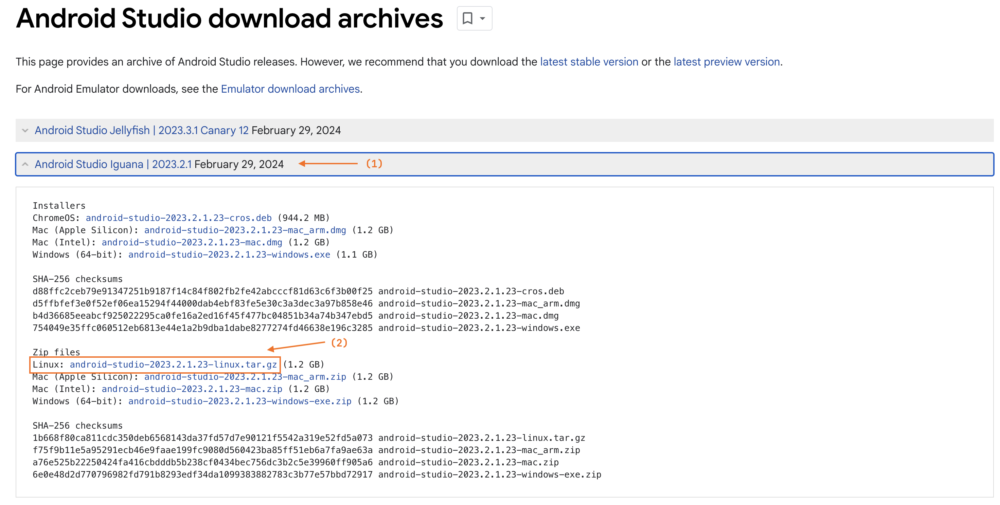

# Обновление Geminio до новой версии Android Studio

Плагин Geminio требует обновления для каждой версии Android Studio. Дело в том, что он основан на некоторых внутренних
API Android Studio, которые иногда меняются, иногда переносятся из одного пакета в другой, а иногда остаются неизменными
от версии к версии.

Этот документ будет небольшой инструкцией для тех, кто хочет самостоятельно обновить плагин под новую версию IDE.

> [!info]
>
> Важно! Инструкция актуальна для пользователей MacOs, на других операционных системах могут быть отличия.
>

## Первые шаги

1. Установить новую версию Android Studio. Это можно сделать через
   приложение [JetBrains Toolbox](https://www.jetbrains.com/toolbox-app/).

2. Открываем окно `About` у новой версии.


3. Из этого окна узнаем обновлённую версию билда Android Studio. Ищем строчку вида `AI-232.10227.8.2321.11479570`, из
   неё
   берём первые три цифры, разделённые точками (в данном случае - "232.10227.8").


4. Идём в корневой файл `gradle.properties` и локально меняем старую версию компилятора и путь к локально установленной
   Android Studio.

```properties
systemProp.androidStudioPath=/Users/p.strelchenko/Applications/Android\ Studio\ Iguana\ 2023.2.1.app/Contents
systemProp.androidStudioCompilerVersion=232.10227.8
```

5. Пытаемся запустить плагин `Geminio`. Желательно заранее подготовить проект с шаблонами (обоих типов: и новых модулей,
   и новых файлов).

6. Если API никак не поменялось, то запуск пройдёт успешно, все шаблоны будут работать корректно.

## Тестирование Geminio

Что обязательно нужно перепроверить:

- [ ] Создание новых файлов через geminio-шаблон.
    - [ ] Если в проекте настроена VCS, то создание новых файлов должно предложить добавить новые файлы в VCS.
- [ ] Добавление зависимостей в `dependencies` блок через geminio-шаблон.
    - [ ] Проверяем дополнительно, что если зависимость уже есть в `dependencies` блоке, то она не добавится.
- [ ] Создание новых модулей через geminio-шаблон.
    - [ ] Geminio должен предложить добавить новый модуль в существующий application-модуль.

## Если API не поменялось

В самом простом случае первые же шаги инструкции сработают корректно. В этом случае нужно проделать следующие действия:

0. Создаём новую ветку в репозитории

1. Перепроверить, что плагины `Carnival` и `Garcon` тоже собираются корректно. Для этого можно запустить
   специальный `Run configuration`, который называется `Build all plugins`.

2. Вернуть обратно значение `systemProp.androidStudioPath`, локальное изменение коммитить нельзя.

3. Вернуть обратно значение `systemProp.androidStudioCompilerVersion` и заменить все строки в проекте со старой версией
   Android Studio на новую версию.

4. Обновить URL для новой версии Android Studio в файлах `.github/build.yml` и `.github/release_build.yml`

Для этого ищите свойство "ANDROID_STUDIO_URL". Ссылку на актуальный архив следует
искать [на этой странице](https://developer.android.com/studio/archive). Ищем нужную версию, копируем ссылку
на `Zip files -> Linux`, заменяем старую ссылку на новую.



5. Обновляем версии плагинов

У каждого плагина есть свой собственный файл `gradle.properties`. Обновите версию каждого плагина (ищите по
строке `pluginVersion=`). Мы меняем минорную версию версию, когда добавляем поддержку новой Android Studio (вторая
цифра).

6. Дописываем changelog для каждого плагина

У каждого плагина есть свой собственный файл `CHANGELOG.md`. Допишите, что поддержали новую версию Android Studio.

7. Делаем PR из ветки в `master`-ветку.

## Если изменилось API Android Studio

Ситуация, когда при обновлении на новую версию Android Studio ломается использование внутренних API, к сожалению, не
такая уж и редкая. Что может произойти?

### Проект перестал компилироваться.

1. Поменялся набор аргументов в вызываемых функциях.
2. Поменялся порядок следования аргументов в вызываемых функциях.

Это, обычно, исправляется легко: синхронизируем проект, чтобы убедиться, что подтянули свежие
исходники из локальной Android Studio, смотрим на обновившуюся сигнатуру функции, исправляем.

Например, класс `YamlUtils` не менялся с первого релиза `Geminio`, но в `Android Studio Iguana | 2023.2.1` обновилась
версия библиотеки `snakeyaml`, поэтому потребовались изменения кода.

Было:

```kotlin
val yaml = Yaml(
    CustomClassLoaderConstructor(
        T::class.java,
        T::class.java.classLoader
    )
)
```

Стало:

```kotlin
val yaml = Yaml(
    CustomClassLoaderConstructor(
        T::class.java,
        T::class.java.classLoader,
        LoaderOptions(),
    )
)
```

3. Свойство, функция были перенесены в другой пакет.

Такое тоже обычно исправляется просто: удаляем из `import` блока строку, вызывающую проблему, с помощью автоимпорта IDE
исправляем ошибку.

4. Используемый класс был перенесён в другой пакет.

В истории Geminio было такое: до версии `Android Studio Chipmunk` класс `StudioWizardDialogBuilder` лежал в
пакете `com.android.tools.idea.ui.wizard`, после этой версии класс перенесли в
пакет `com.android.tools.idea.wizard.ui.StudioWizardDialogBuilder`.

Чтобы сохранить обратную совместимость плагина `Geminio`, приходится делать интересные хаки компиляции:

- Создавать модуль с stub-классами для Android Studio (ищи модуль `shared:core:android-studio-stubs`).
- Подключать этот модуль через `compileOnly` к основному модулю плагинов.
- В рантайме определять наличие класса по его FQCN (для примера смотри класс `StudioWizardDialogFactory`).

### Проект крашится в рантайме

В этом случае нужно разбирать каждую проблему отдельно. Иногда это получается просто, но чаще всего требуется
дополнительное погружение в исходники Android Studio. В этом случае рекомендуется
открывать [исходники Android-проектов](https://cs.android.com/) и искать по названию класса, который упал.

Например, при обновлении на `Android Studio Iguana` перестали работать шаблоны новых модулей. IDE показала stacktrace:
при вызове `com.android.tools.idea.npw.template.ProjectTemplateDataBuilder.build` произошёл `NullPointerException`.

Пытаемся разобраться (скорее всего потребуется работа с дебаггером), в итоге находим ошибку: начиная
с `Android Studio Iguana` требуется устанавливать свойство `agpVersion` в `ProjectTemplateDataBuilder`.

```kotlin
builder.agpVersion = AgpVersions.latestKnown
```

> А почему разбираемся не через исходники внутри IDE, тут же можно посмотреть и использования классов и переходы можно
> осуществлять?

Потому что при подключении локальной версии Android Studio исходники с документацией превращаются в декомпилированные
исходники с потерей большой доли информации. По ним практически невозможно ни в чём разобраться. А если подключать "
актуальную версию Android Studio" не локально, то можно столкнуться с тем, что исходники `Android Studio`, которую
вы хотите поддержать, и исходники `Android Studio`, которую скачает `gradle-intellij-plugin`, окажутся
**НЕ ЭКВИВАЛЕНТНЫ**. С другой стороны, вам может повезти и исходники будут похожи на правду.

Как подключить нужную версию:

- Заходим в файл `ExternalLibrariesExtension`.
- Находим там `enum class PredefinedIdeProducts`.
- По аналогии с другими элементами создаём описание нужной вам версии `Android Studio`.
- Меняем свойство `val chosenIdeaVersion: Product = PredefinedIdeProducts.ANDROID_STUDIO_IGUANA.product`.
- И добиваемся синхронизации проекта (компиляция и запуск необязательны, хотя бы синхронизация, чтобы получить доступ к
  исходникам).
