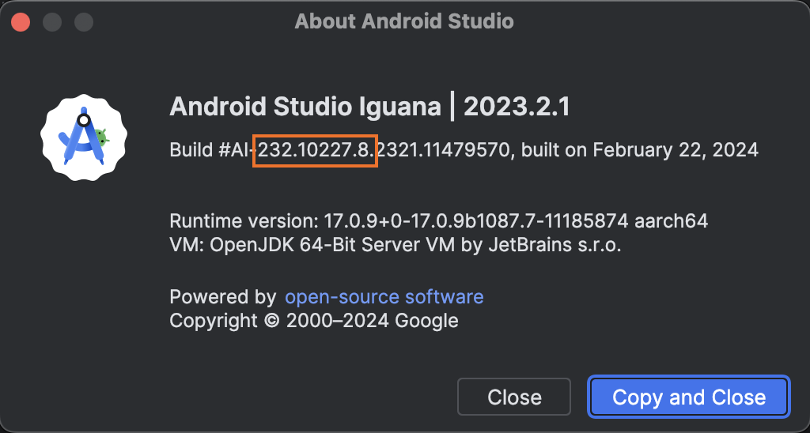

# Обновление Geminio до новой версии Android Studio

Плагин Geminio требует обновления для каждой версии Android Studio. Дело в том, что он основан на
некоторых внутренних API Android Studio, которые иногда меняются, иногда переносятся из одного
пакета в другой, а иногда остаются неизменными от версии к версии.

Этот документ будет небольшой инструкцией для тех, кто хочет самостоятельно обновить плагин под
новую версию IDE.

> [!info]
>
> Важно! Инструкция актуальна для пользователей MacOs, на других операционных системах могут быть
> отличия.
>

## Первые шаги

1. Установить новую версию Android Studio. Это можно сделать через
   приложение [JetBrains Toolbox](https://www.jetbrains.com/toolbox-app/).

2. Открываем окно `About` у новой версии.
    <details>

    <summary>Скриншоты</summary>

   
   

    </details>

3. Ищем строчку вида `AI-232.10227.8.2321.11479570`, берём первые три числа, разделённые точками (в
   данном случае - "232.10227.8").

   <details>
   <summary>Скриншот</summary>

   

   </details>

4. Идём в корневой файл `build.gradle.kts` и меняем версию Android Studio в зависимости
   `androidStudio(...)`.

   ```kotlin
   intellijPlatform {
       // Android Studio Panda 3 Patch 1
       androidStudio("2025.3.3.7")
   }
   ```

   Версию для Gradle-плагина удобнее сверять со
   [списком релизов Android Studio](https://plugins.jetbrains.com/docs/intellij/android-studio-releases-list.html).

5. Пытаемся запустить плагин `Geminio` через встроенную в проект конфигурацию `Run Plugin`
   или через Gradle-таску `./gradlew runIde`.
   Желательно заранее подготовить проект с шаблонами (обоих типов: и новых модулей, и новых файлов).

6. Если API никак не поменялось, то запуск пройдёт успешно, все шаблоны будут работать корректно.

## Тестирование Geminio

Что обязательно нужно перепроверить:

- [ ] Создание новых файлов через geminio-шаблон.
    - [ ] Если в проекте настроена VCS, то создание новых файлов должно предложить добавить новые
      файлы в VCS.
- [ ] Добавление зависимостей в `dependencies` блок через geminio-шаблон.
    - [ ] Проверяем дополнительно, что если зависимость уже есть в `dependencies` блоке, то она не
      добавится.
- [ ] Создание новых модулей через geminio-шаблон.
    - [ ] Geminio должен предложить добавить новый модуль в существующий application-модуль.

## Если API не поменялось

В самом простом случае первые же шаги инструкции сработают корректно. В этом случае нужно проделать
следующие действия:

1. **Создаём новую ветку в репозитории**

2. **Обновить версию Android Studio для сборки**

   Обновите значение `androidStudio(...)` в корневом
   [build.gradle.kts](../../build.gradle.kts). Эта версия используется для компиляции, `runIde`,
   сборки плагина и CI-проверок.

3. **Обновляем версию плагина**

   Обновите версию `hh-geminio` в корневом
   [gradle.properties](../../gradle.properties) (ищите по строке `version=`). Мы меняем минорную
   версию, когда добавляем поддержку новой Android Studio (вторая цифра).

4. **Дописываем changelog плагина**

   Обновите [CHANGELOG.md](../../CHANGELOG.md) и допишите, что поддержали новую версию Android Studio.

5. **Проверяем сборку**

   Минимальный набор проверок:

   ```bash
   ./gradlew test
   ./gradlew buildPlugin verifyPluginStructure verifyPlugin
   ```

6. Делаем PR из ветки в `master`-ветку.

## Если изменилось API Android Studio

Ситуация, когда при обновлении на новую версию Android Studio ломается использование внутренних API, к сожалению, не такая уж и редкая. Что может произойти?

### Проект перестал компилироваться.

1. Поменялся набор аргументов в вызываемых функциях.
2. Поменялся порядок следования аргументов в вызываемых функциях.

Это, обычно, исправляется легко: синхронизируем проект, чтобы убедиться, что подтянули свежие
исходники из локальной Android Studio, смотрим на обновившуюся сигнатуру функции, исправляем.

Например, класс `YamlUtils` не менялся с первого релиза `Geminio`, но в
`Android Studio Iguana | 2023.2.1` обновилась версия библиотеки `snakeyaml`, поэтому потребовались
изменения кода.

Было:

```kotlin
val yaml = Yaml(
    CustomClassLoaderConstructor(
        T::class.java,
        T::class.java.classLoader
    )
)
```

Стало:

```kotlin
val yaml = Yaml(
    CustomClassLoaderConstructor(
        T::class.java,
        T::class.java.classLoader,
        LoaderOptions(),
    )
)
```

3. Свойство, функция были перенесены в другой пакет.

Такое тоже обычно исправляется просто: удаляем из `import` блока строку, вызывающую проблему, с
помощью автоимпорта IDE исправляем ошибку.

4. Используемый класс был перенесён в другой пакет.

В истории Geminio было такое: до версии `Android Studio Chipmunk` класс `StudioWizardDialogBuilder`
лежал в пакете `com.android.tools.idea.ui.wizard`, после этой версии класс перенесли в пакет
`com.android.tools.idea.wizard.ui.StudioWizardDialogBuilder`.

Чтобы сохранить обратную совместимость плагина `Geminio`, приходится делать интересные хаки
компиляции:

- Создавать stub-классы для Android Studio прямо в исходниках плагина. Пример:
  `src/main/kotlin/com/android/tools/idea/ui/wizard/StudioWizardDialogBuilder.kt`.
- В рантайме определять наличие класса по его FQCN (для примера смотри класс
  `StudioWizardDialogFactory`).
